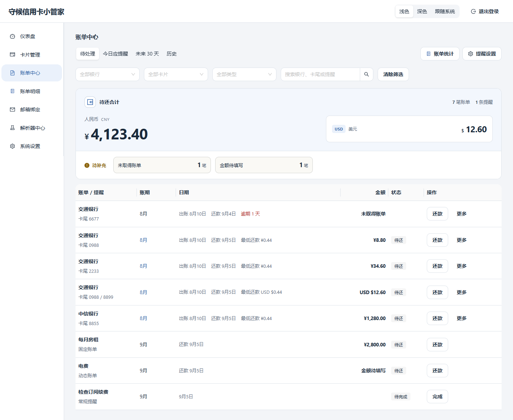
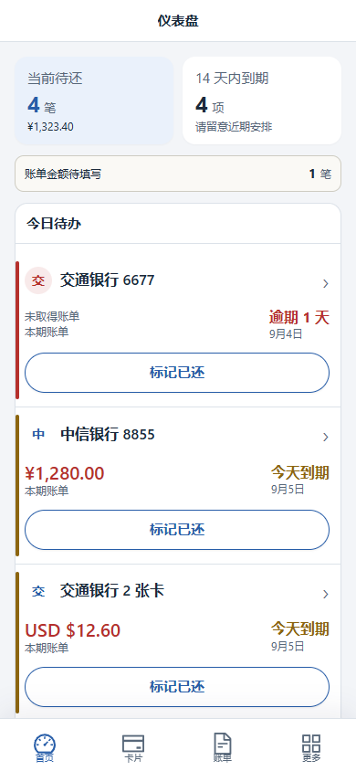
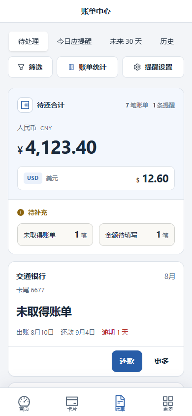
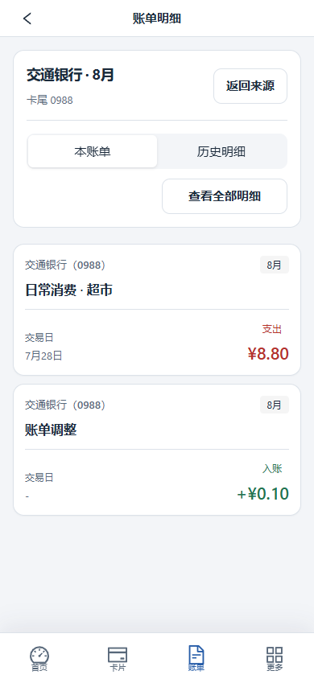
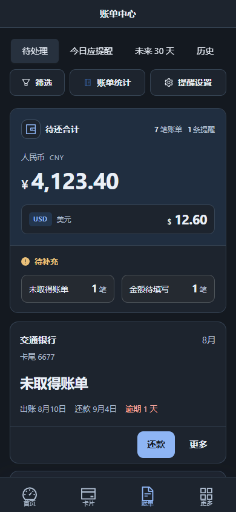
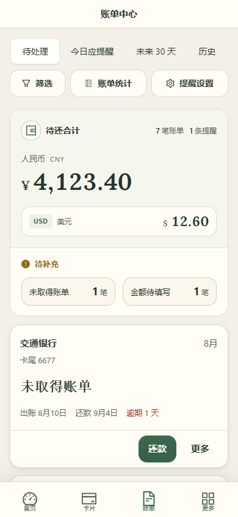
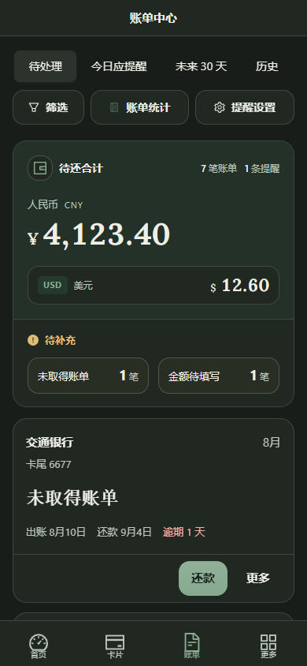
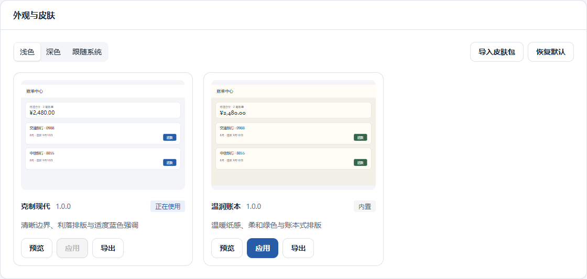

# 守候信用卡小管家

[](https://github.com/kukushouhou/card-bill-assistant/actions/workflows/ci.yml)
[](https://github.com/kukushouhou/card-bill-assistant/releases)
[](./LICENSE)
[](https://github.com/users/kukushouhou/packages/container/package/card-bill-assistant)


一个面向个人自托管的信用卡账单与到期提醒工具。自动读取银行账单邮件，将信用卡账单、日常账单和到期提醒集中在「账单中心」，支持还款登记、交易查询、年费提醒及多渠道推送。电脑端与手机端分别设计交互，提供完整皮肤包和浅色、深色模式。

- 当前稳定版本：`v0.4.0`（[查看本版本完整发布说明](./docs/releases/v0.4.0.md)）
- 官方容器镜像：`ghcr.io/kukushouhou/card-bill-assistant:0.4.0`

> 该项目处理邮箱授权码和信用卡信息，建议仅部署在可信设备上，使用 HTTPS，并定期备份数据库与 `.env`。不要将应用或 MySQL 端口直接暴露到公网。

## 目录

- [完整功能](#完整功能)
- [界面预览与设备支持](#界面预览与设备支持)
- [支持的银行邮件与解析层级](#支持的银行邮件与解析层级)
- [安全与数据边界](#安全与数据边界)
- [部署方式](#部署方式)
  - [使用 AI 协助部署（推荐）](#方式一使用-ai-协助部署推荐)
  - [手动使用官方 Docker 镜像](#方式二手动使用官方-docker-镜像)
  - [使用 Docker 从源码构建](#方式三使用-docker-从源码构建)
  - [手动源码部署（不使用 Docker）](#方式四手动源码部署不使用-docker)
- [本地开发](#本地开发)
- [新增银行解析器](#新增银行解析器)
- [技术栈](#技术栈)
- [许可证](#许可证)

## 完整功能

以下功能介绍与界面截图对应当前源码版本。

### 账单中心

信用卡账单、固定账单、动态账单与常规提醒共用一个入口。还款、出账和年费提醒也在这里查看，无需在账单列表和提醒列表之间反复切换。

| 查看范围 | 可以看到什么 |
| --- | --- |
| 待处理 | 未还清账单、未取得账单及已生成的未完成常规提醒，按到期日期排列，逾期优先 |
| 今日应提醒 | 当天触发的还款、出账、年费和自定义提醒，可立即推送并查看发送结果 |
| 未来 30 天 | 接下来一个月的安排；尚未具备处理条件的记录可提前查看 |
| 历史 | 按月份归组的已还清账单和已完成常规提醒，展开查看具体记录 |

- **每笔账单归属清楚**：未还和部分已还账单逐笔显示银行、卡尾、账期、待还金额与还款日；合并账单列出涉及的卡尾，只显示和统计一次。
- **同一账单不重复提醒**：提前提醒、到期提醒附在对应账单上，不重复增加账单行或累计金额。
- **汇总与状态分开呈现**：不同币种分别汇总，未取得账单与金额待填写单独标明；常规提醒、出账提醒和年费提醒不计入待还金额。
- **历史按账期整理**：已还清账单折叠归组，显示完整账期的笔数和分币种合计；同月尚未还清的账单继续逐笔显示。
- **快速定位记录**：可按银行、卡片和记录类型筛选，或搜索银行、卡尾与提醒名称。
- **处理后留在原处**：还款或完成提醒后更新记录与汇总；提醒的新增、编辑、停用和删除集中在「提醒设置」，金额走势收在「账单统计」。

### 统一交易明细与还款记录

**点击具体信用卡账单 → 查看本账单 → 切换相关卡片历史 → 返回原来的列表位置。**

- 账单中心、卡片详情和首页年费入口共用明细页；即使该账单暂无明细，也可以进入并继续查看历史。
- 「本账单」查看该账单的全部交易，跨自然月份或缺少交易日期的明细也保留；「历史明细」默认限定为该账单涉及的卡片，可按账期查询。
- 「查看全部明细」进入全局查询，支持按银行、卡片、交易日期及交易描述检索；显示交易归属、入账金额，以及邮件提供的原币金额等信息。
- 招商银行「每日信用管家」支持同步本账期的未出账日度交易，在正式账单到来前即可查询；这些交易不提前计入待还和账单统计。
- 可逐笔登记部分或全部还款、调整还款记录、恢复待还，或删除真实账单；未取得账单及自定义账单保留各自的还款流程。
- 返回时保留来源的筛选、分页、滚动和展开状态；还款、删除等操作独立触发，不会误跳进明细页。

### 卡片中心与敏感卡信息

- 首次解析到账单时自动建立信用卡档案，也支持手动新增、编辑和删除；每张卡独立管理别名、持卡人、出账日、还款规则、提醒提前天数和年费日。
- 套卡集中浏览，并保留各张卡自己的资料和账单归属；可将其中一张正常使用的卡「设为主卡」，在卡片列表中优先展示。
- 电脑端通过卡片网格浏览套卡，手机端通过横向滑动切换卡片；卡面展示该卡的本期应还和下一还款日，下方账单区展示套卡待还合计与逐笔账单。
- 套卡内同月的不同账单分别标注卡尾，每笔独立还款；已还清账单进入对应账期的历史组。
- 支持按银行、出账日、还款日、年费日排序，按银行、卡尾、别名和持卡人搜索；可通过「标记异常」调整卡片的使用状态。
- 完整卡号、有效期和 CVV 加密保存。每次查看或编辑前验证 PIN，验证后在原卡面展开；收起、切换卡片或离开页面后清除明文。

### 银行账单邮件同步与解析

- 支持绑定多个 IMAP 邮箱账户，使用授权码连接；同步不将邮件标记为已读，也不删除邮件。
- 每 2 小时自动增量同步，也可手动同步、按所选时间范围重新同步，或拉取全部历史账单邮件。
- 邮箱编辑可分别测试连接和保存；同步结果可直接查看对应账户日志。历史拉取支持退出进度界面，任务继续运行，可从任务条重新查看。
- 通过发件人、标题和模板特征识别账单，只有匹配银行解析器的邮件才进入账单流程。
- 按邮件提供的内容提取账期、出账日、还款日、应还金额、最低还款额、币种、卡尾及交易明细，支持多币种和多卡合并账单。
- 同步日志记录解析成功、未匹配、图片账单和错误；解析器中心可查看支持的模板，对指定邮箱邮件试解析，并查看原文以核对结果。

### 年费识别、预告与显著提醒

- 从交易明细识别实际年费金额，并按真实交易卡归属年费；年费交易会在账单与交易明细中单独标记。
- 可从历史年费交易自动识别卡片年费日，也可手动设置且手动设置不会被后续自动识别覆盖。
- 在年费即将计入下一期账单前，根据年费日和上一期账单还款日生成提前提醒。
- 新账单出现尚未处理的实际年费时，首页显示独立的高优先级年费提醒，按银行与币种汇总金额，可查看涉及的卡片、账期和交易明细。
- 年费显著提醒可单独确认；对应账单已部分还款或已还清后不再继续显示。

### 提醒设置与周期账单

从账单中心进入「提醒设置」，集中管理常规提醒、固定账单和动态账单；到期记录统一回到账单中心处理。

| 类型 | 适用场景 | 处理方式 |
| --- | --- | --- |
| 常规提醒 | 证件到期、会员续费、纪念日、定期检查等非账单事项 | 到期后标记「完成」 |
| 固定账单 | 房租、宽带、保险等每期金额固定的账单 | 预设固定金额，按期进入账单中心并登记还款 |
| 动态账单 | 水电燃气、物业费等每期金额变化的账单 | 每期还款时填写实际金额，并保留该期记录 |

- 三类都支持单次、按天、按周、按月和按年；循环周期可设置为每 N 天、N 周、N 月或 N 年。
- 按周可指定星期；按月可选择 1–28 日、月末当天、月末前 1 天或月末前 2 天；按年可指定月份和日期。
- 可同时选择多个提前提醒时间，并在保存前预览接下来 3 个提醒或还款日期。
- 每项支持名称、备注和启用/停用；停用时可选择保留当前未处理项，或同时将其隐藏。
- 常规提醒、固定账单和动态账单会生成独立期次，不会因为修改后续周期而丢失已经完成或已还的历史记录。
- 新增、编辑完成或取消后回到提醒设置，保留原来的列表位置。

### 首页与电脑、手机交互

- 首页提供「当前待还」、年费显著提醒、「今日待办」、「未来 14 天」和最近 6 个月账单走势，各分区独立加载、报错和重试。
- 今日待办按紧迫程度展示待处理记录，逾期优先；可直接完成常规提醒、标记信用卡还款或登记自定义账单还款。
- 电脑端使用宽屏表格、卡片网格与分区表单，支持鼠标和键盘；手机端使用「首页／卡片／账单／更多」底部导航、全屏业务流程和触控筛选面板。
- 金额、卡片身份、日期与操作分层呈现，标签和值保持对齐；不同币种独立展示，待补充信息单独提示。
- 当年账期显示为「8月」，历史账期显示为「2025年8月」；出账日与还款日分别标注，跨年日期明确年份。
- 编辑和提交失败时保留输入，退出未保存表单时确认；连续点击不会重复提交。刷新失败保留已有内容，返回列表恢复原来的查看位置。

### 完整皮肤包与明暗模式

系统设置中的「外观与皮肤」提供皮肤包管理。内置 **克制现代** 与 **温润账本**：前者采用中性底色、清晰边框和少量蓝色强调，后者采用暖白纸感、柔和绿色和更温和的组件造型。每套均提供电脑浅色、电脑深色、手机浅色、手机深色四种效果。

| 可定制部分 | 皮肤包能力 |
| --- | --- |
| 背景与材质 | 背景图、纹理、渐变、透明度、模糊和非交互装饰 |
| 字体与图形 | 随包字体、字重与字号层级、图标和品牌图形 |
| 组件与排版 | 按钮、输入框、导航、卡片、列表、标签和弹层样式，以及留白、尺寸、边框、圆角和阴影 |
| 图表与动效 | 图表配色、线条、文字、网格和提示框，以及过渡、装饰动画和减少动态效果适配 |
| 设备与明暗 | 电脑、手机与浅色、深色分别提供样式和素材，可共用基础定义 |

- **导入与预览**：直接导入 ZIP 包，在使用示例数据的真实组件中切换四种效果；导入和取消预览均不改变正在使用的皮肤。
- **应用与更新**：资源准备完成后切换，无需重新编译或部署；同一皮肤可导入新版本再选择应用，加载或更新失败保留原皮肤。换肤保留当前页面、表单和正在进行的操作。
- **导出与制作**：内置、自定义皮肤均可连同素材导出，用作备份或制作范本；提供可直接安装的[石墨账本示例包](./docs/skins/examples/graphite-notebook.zip)。
- **删除与恢复**：支持删除自定义皮肤、恢复默认；删除正在使用的皮肤时明确执行「恢复默认并删除」，保留明暗偏好。
- **跨设备偏好**：应用的皮肤在设备间同步，其他设备回到前台时更新；浅色、深色或跟随系统按浏览器独立保存，默认跟随系统。电脑顶栏和手机「更多」提供明暗快捷入口。

皮肤通过样式文件与素材包定制，保持功能入口、操作含义和必要信息一致。制作方法见[皮肤制作规范](./docs/skins/制作规范.md)，资源持久化及接口见[部署与接口](./docs/skins/部署与接口.md)。

### 多渠道推送与自动任务

- 内置 Bark、ntfy、Gotify、Telegram Bot、Server酱、PushPlus、企业微信机器人、钉钉机器人和飞书机器人；还可配置自定义 HTTP 推送。
- 可在安装向导一次选择多个渠道，也可在系统设置中分别绑定、启用、停用、移除和发送测试通知。所有启用渠道会同时收到当天提醒。
- Bark 的高级设置支持自定义推送分组、通知铃声、通知级别和图标；设置页可直接用尚未保存的当前配置发送测试通知。
- 自定义 HTTP 推送默认只需填写请求方法、URL 和基础参数；展开高级设置后可配置查询参数、请求头、JSON/表单/纯文本正文及模板。模板支持 `{{title}}`、`{{body}}`、`{{group}}`、`{{count}}`、`{{appName}}` 占位符，不执行用户脚本。
- 通知渠道配置加密保存；切换渠道前会提醒处理尚未保存的修改。
- 每天在配置的提醒时间先同步启用的邮箱，再汇总当天的还款、出账、年费和自定义提醒后推送；默认时间为上海时区 8:00。
- 同一渠道的多条当日提醒会合并为一条批量通知，减少连续打扰。
- 同一条当日提醒不会向同一渠道重复发送，发送失败的渠道可在后续任务中重试。
- 账单中心的「今日应提醒」支持手动执行「立即推送今日提醒」，仍遵循同一天不重复发送的规则。

### 首次使用与自托管

- 首次访问通过安装向导设置登录密码、可选 PIN、通知渠道及内置皮肤，后续可在系统设置中调整。
- 电脑、手机和平板浏览器访问同一地址即可使用，无需安装原生客户端。
- 支持官方 Docker 镜像、Docker 源码构建和 Node.js 源码部署，可选择内置 MySQL 或外置 MySQL。

## 界面预览与设备支持

本项目是响应式 Web 应用，无需安装原生客户端。电脑浏览器、手机和平板浏览器访问同一地址即可使用；桌面端会充分利用宽屏空间，触屏端会切换为适合手指操作的导航和信息布局。

| 使用设备 | 支持情况 | 交互形态 |
| --- | :---: | --- |
| 电脑端 | ✓ | 宽屏卡片/表格布局，适合鼠标与键盘 |
| 手机触屏端 | ✓ | 移动导航、单列信息流与大触控区域 |
| 平板触屏端 | ✓ | 根据可用宽度在移动与多列布局间自适应 |

以下为当前源码版本的实际界面截图，均使用示例数据。

### 账单中心（电脑端）



### 手机端

<table>
  <tr><th>首页</th><th>账单中心</th><th>统一明细</th></tr>
  <tr>
    <td></td>
    <td></td>
    <td></td>
  </tr>
</table>

### 深色模式与皮肤

每套皮肤均适配电脑、手机与浅色、深色模式。

<table>
  <tr><th>克制现代 · 深色</th><th>温润账本 · 浅色</th><th>温润账本 · 深色</th></tr>
  <tr>
    <td></td>
    <td></td>
    <td></td>
  </tr>
</table>

<details>
  <summary>查看卡片中心与皮肤管理（电脑端）</summary>
  <p>卡片中心</p>
  
  <p>皮肤管理</p>
  
</details>

## 支持的银行邮件与解析层级

解析器按已获得的银行邮件模板校准，并非对银行所有历史和未来格式的承诺。银行改版后可能需要新的版本化解析器。

- **账单摘要**：出账日/账单期、还款日、应还金额、最低还款额、币种和卡尾等，以邮件实际提供字段为准。
- **交易明细**：正式账单中的交易日期、摘要、金额、币种与卡尾等结构化数据。
- **未出账单日度明细**：尚未形成正式账单的本账期日度交易；当前仅招商银行「每日信用管家」支持。

| 银行 | 已校准模板 | 账单摘要 | 交易明细 | 未出账单日度明细 | 说明 |
| --- | --- | :---: | :---: | :---: | --- |
| 招商银行 | 2016 / 2020 / 2026 | ✓ | ✓ | ✓ | 2020/2026 账单支持明细；日度明细仅同步本账期，正式账单仍是还款和统计依据 |
| 中国工商银行 | 2026（含历史附件形态） | ✓ | ✓ | — | 支持正文或账单附件中的明细 |
| 中国农业银行 | 2019 / 2026 | ✓ | ✓ | — | 支持新旧发件域名和对账单格式 |
| 中国银行 | 2020 / 2026 | ✓ | ✓ | — | 支持邮件正文及 PDF 账单文本 |
| 中国建设银行 | 2026 | ✓ | ✓ | — | 支持多卡和原交易/入账币种信息 |
| 交通银行 | 2019 / 2026 | ✓ | ✓ | — | 支持人民币与美元账户 |
| 中信银行 | 2020 / 2023 / 2026 | ✓ | ✓ | — | 卡尾优先以交易明细中的四位卡尾为准 |
| 中国光大银行 | 2016 / 2017 / 2019 / 2026 | ✓ | ✓ | — | 支持多版本邮件/PDF 格式和多币种 |
| 华夏银行 | 2020 / 2026 | ✓ | ✓ | — | 支持人民币与美元账户 |
| 广发银行 | 2026 | ✓ | ✓ | — | 支持多卡与多币种明细 |
| 兴业银行 | 2026 | ✓ | ✓ | — | — |
| 平安银行 | 2019 / 2026 | ✓ | ✓ | — | 支持合并账单的多卡区块归属 |
| 浦发银行 | 2021 / 2026 | ✓ | — | — | 邮件只提供账单金额、最低还款额和日期等摘要；交易明细位于银行跳转页，访问时需要短信验证，因此无法自动抓取 |
| 中国民生银行 | 2026 | ✓ | ✓ | — | 支持人民币与美元账户 |
| 中国邮政储蓄银行 | 2022 / 2026 | ✓ | ✓ | — | 支持新旧发件域名 |
| 北京银行 | 2021 / 2026 | ✓ | ✓ | — | 现役模板支持合并账单明细 |
| 南京银行 | 2023 / 2026 | ✓ | ✓ | — | 2026 模板支持明细；2023 海报式历史模板为摘要级 |
| 湖南银行 | 2026（兼容华融湘江银行域名） | ✓ | ✓ | — | 支持合并账单多卡尾 |
| 湖南农信 | 2026 | ✓ | ✓ | — | 支持福祥信用卡电子账单 |
| 长沙银行 | 2026 | ✓ | ✓ | — | 支持合并账单多卡尾 |

一封邮件只有在发件人、标题和模板特征命中解析器后才会进入账单流程。不匹配的营销邮件不会被当成账单。

## 安全与数据边界

- 完整卡号、有效期和 CVV 使用「环境主密钥 + 用户 PIN」双密钥 AES-256-GCM 加密。
- PIN 不存储在后台；后台仅保存用于校验的随机盐和验证器。
- 邮件正文不入库；数据库保存邮件元数据和解析后的结构化账单/交易数据。
- IMAP 同步只读取新 UID，不会将银行邮件标记为已读。
- `ENCRYPTION_KEY` 一旦用于写入数据便不能更换，否则已有密文无法解密。
- 本项目不代替银行官方账单、还款通知或账户安全措施。

## 部署方式

推荐优先使用 AI 协助部署；也可以手动使用官方 Docker 镜像、从 Docker 源码构建，或完全不使用 Docker 进行源码部署。

## 方式一：使用 AI 协助部署（推荐）

一键复制以下提示词到任意 AI 工具即可：

```text
我希望部署「守候信用卡小管家」。请先完整阅读并严格遵循下面的 AI 部署提示词：
https://raw.githubusercontent.com/kukushouhou/card-bill-assistant/main/AI_DEPLOYMENT_PROMPT.md

项目仓库：
https://github.com/kukushouhou/card-bill-assistant

阅读后请不要立即执行部署。先按照部署提示词询问我尚未提供的必要信息，为每项选择给出推荐默认值并说明影响；待方案确认后，再指导我完成环境变量配置、Docker Compose 启动和健康检查。涉及密码、密钥或完整数据库连接串时，请提示安全风险并推荐优先在目标设备本地填写；是否在对话中提供由我自行决定。仅当这是已有部署升级且目标版本包含数据库变更时，才询问是否先备份；内置和外置 MySQL 使用同一规则。只有我确认需要备份后，才继续询问保存位置，并仅在选定目标已存在时询问是否覆盖。
```

## 方式二：手动使用官方 Docker 镜像

### 图形化 Docker 管理界面

适用于任何支持粘贴或导入 Docker Compose YAML 的图形化管理界面。点击下面的链接进入源文件页面，使用页面右上角的复制按钮复制全部内容，再粘贴到新建项目、Stack 或编排任务中：

- **内置 MySQL：** [打开并复制 docker-compose.yml](./docker-compose.yml)
- **外置 MySQL：** [打开并复制 docker-compose.external.yml](./docker-compose.external.yml)
- **环境变量：** [打开并复制 .env.docker.example](./.env.docker.example)

### 命令行部署

#### 前置条件

- 64 位 `amd64` 或 `arm64` 主机。
- Docker Engine 与 Docker Compose v2。
- 内置模式使用项目提供的 MySQL 8.4；外置模式需要已创建的 MySQL 数据库及建表权限。

#### 方案 A：内置 MySQL

使用 [docker-compose.yml](./docker-compose.yml)，点击链接可直接查看或复制完整配置。

先克隆 `v0.4.0` 的部署文件：

```bash
git clone --branch v0.4.0 --depth 1 https://github.com/kukushouhou/card-bill-assistant.git
cd card-bill-assistant
```

Linux/NAS（内置 MySQL）：

```bash
sh ./scripts/gen-env.sh
docker compose pull
docker compose up -d
```

Windows PowerShell（内置 MySQL）：

```powershell
pwsh ./scripts/gen-env.ps1
docker compose pull
docker compose up -d
```

该方案会启动应用与 MySQL 两个容器，数据保存在 `db-data` Docker 卷中。MySQL 没有对宿主机暴露端口。

#### 方案 B：外置 MySQL

使用 [docker-compose.external.yml](./docker-compose.external.yml)，点击链接可直接查看或复制完整配置。

Linux/NAS：

```bash
sh ./scripts/gen-env.sh --external
# 在目标主机本地编辑 .env 中的 DATABASE_URL
docker compose -f docker-compose.external.yml pull
docker compose -f docker-compose.external.yml up -d
```

Windows PowerShell：

```powershell
pwsh ./scripts/gen-env.ps1 -External
# 在目标主机本地编辑 .env 中的 DATABASE_URL
docker compose -f docker-compose.external.yml pull
docker compose -f docker-compose.external.yml up -d
```

MySQL 密码中的特殊字符必须进行 URL 编码。例如 `@` 为 `%40`、`&` 为 `%26`、`#` 为 `%23`。

### 关键环境变量

| 变量 | 必填 | 默认值 | 用途 |
| --- | :---: | --- | --- |
| `APP_VERSION` | 否 | `0.4.0` | GHCR 镜像版本；生产环境建议固定版本 |
| `DATABASE_URL` | 外置模式 | 无 | MySQL 连接串 |
| `MYSQL_ROOT_PASSWORD` | 内置模式 | 脚本随机生成 | MySQL root 密码 |
| `MYSQL_PASSWORD` | 内置模式 | 脚本随机生成 | 应用数据库账号密码 |
| `ENCRYPTION_KEY` | 是 | 脚本随机生成 | 邮箱授权码、通知渠道配置和卡信息的环境主密钥，不可更换 |
| `JWT_SECRET` | 是 | 脚本随机生成 | 登录会话签名 |
| `COOKIE_SECURE` | 否 | `true` | HTTPS 部署保持 `true`；仅局域网纯 HTTP 部署才设 `false` |
| `APP_BIND_IP` | 否 | `0.0.0.0` | 宿主机绑定地址 |
| `APP_PORT` | 否 | `3000` | 宿主机访问端口 |
| `APP_NAME` | 否 | 守候信用卡小管家 | 登录页、导航栏、页面标题和通知名称 |
| `REMINDER_HOUR` | 否 | `8` | 上海时区每日提醒小时（0–23） |

启动脚本默认不覆盖已有 `.env`。升级或迁移时必须保留原来的 `ENCRYPTION_KEY`。

## 方式三：使用 Docker 从源码构建

需要审阅、修改源码或自行生成本地镜像时，在对应数据库编排上叠加 [docker-compose.build.yml](./docker-compose.build.yml)：

```bash
# 内置 MySQL
sh ./scripts/gen-env.sh
docker compose -f docker-compose.yml -f docker-compose.build.yml up -d --build

# 外置 MySQL
sh ./scripts/gen-env.sh --external
# 在目标主机本地编辑 .env 中的 DATABASE_URL
docker compose -f docker-compose.external.yml -f docker-compose.build.yml up -d --build
```

本地构建镜像名为 `card-bill-assistant:local`，不会覆盖官方 GHCR 镜像。

## 方式四：手动源码部署（不使用 Docker）

适合已经自行维护 Node.js 进程、MySQL、HTTPS 反向代理和系统服务的环境。需要 Node.js 24 与 MySQL 8：

```bash
git clone --branch v0.4.0 --depth 1 https://github.com/kukushouhou/card-bill-assistant.git
cd card-bill-assistant

cd web
npm ci
npm run build

cd ../server
cp ../.env.example .env
# 在本机编辑 server/.env，至少填写 DATABASE_URL、ENCRYPTION_KEY、JWT_SECRET
# 通过 HTTPS 部署时将 COOKIE_SECURE 改为 true
npm ci --omit=dev
npx prisma generate
npx prisma migrate deploy
NODE_ENV=production npm start
```

服务端会直接托管 `web/dist`，默认监听 `3000` 端口。生产环境应使用 systemd、Supervisor 或 NAS 套件守护进程，并通过 HTTPS 反向代理访问。Windows PowerShell 可将最后一行改为 `$env:NODE_ENV='production'; npm start`。完整的升级、服务守护与备份说明见 [DEPLOY.md](./DEPLOY.md)。

### HTTPS 与登录 Cookie

Docker 默认 `COOKIE_SECURE=true`。请在 NAS 或网关中将 HTTPS 域名反向代理到应用端口。如果只在受信任的局域网使用纯 HTTP，需要显式设置：

```env
COOKIE_SECURE=false
```

纯 HTTP 不提供传输加密，不建议用于无线公共网络或任何公网环境。

### 首次安装

访问应用地址后，Web 向导会依次完成：

1. 数据库环境检查。
2. 设置内置 `admin` 管理员密码和可选的六位 PIN。
3. 选择并配置一个或多个通知渠道，也可暂时跳过。
4. 完成安装并登录。

安装完成后 `POST /api/setup/install` 会永久拒绝再次安装。

### 健康检查与日志

```bash
docker compose ps
docker compose logs --tail=200 app
curl -fsS http://127.0.0.1:3000/api/health
curl -fsS -o /dev/null http://127.0.0.1:3000/
curl -fsS -o /dev/null http://127.0.0.1:3000/login
```

如果修改了 `APP_PORT`，请在健康检查中使用实际端口。根地址验证首页，`/login` 验证浏览器直接打开或刷新前端路由时仍能回退到 Web 应用。Compose 已为应用和 MySQL 配置日志轮转。

更完整的数据库备份、升级和运维命令见 [DEPLOY.md](./DEPLOY.md)。

## 本地开发

环境要求：Node.js 24+ 与 MySQL 8。

```bash
# 后端
cd server
npm install
npx prisma generate
npx prisma migrate deploy
npm run dev

# 前端（另一个终端）
cd web
npm install
npm run dev
```

开发环境后端默认为 `http://localhost:3000`，前端为 `http://localhost:5173`。Vite 会将 `/api` 代理到后端。

提交前验证：

```bash
cd server
npm test
npm run typecheck

cd ../web
npm run build
```

## 新增银行解析器

1. 在 `server/src/parsers/banks/` 新建「银行拼音-校准年份」文件。
2. 实现解析器接口，以发件人和账单标题建立白名单。
3. 在 `server/src/parsers/registry.ts` 注册，新模板优先级高于历史模板。
4. 增加脱敏样本测试，确保失败时可回退历史解析器。
5. 不要提交真实邮件原文、持卡人姓名、完整卡号、邮箱授权码或本地 `.env`。

## 技术栈

- 后端：Node.js 24、Express 5、Prisma 7、MySQL、Vitest。
- 前端：React 19、Vite 8、Ant Design 6、Ant Design Mobile、`@ant-design/plots`。
- 部署：Docker 多阶段构建、Docker Compose、内置/外置 MySQL 双模式。

## 许可证

本项目使用 [MIT License](./LICENSE)。
