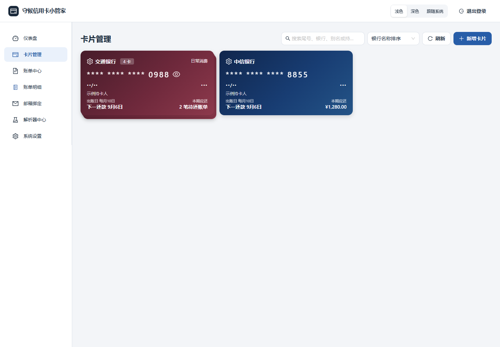
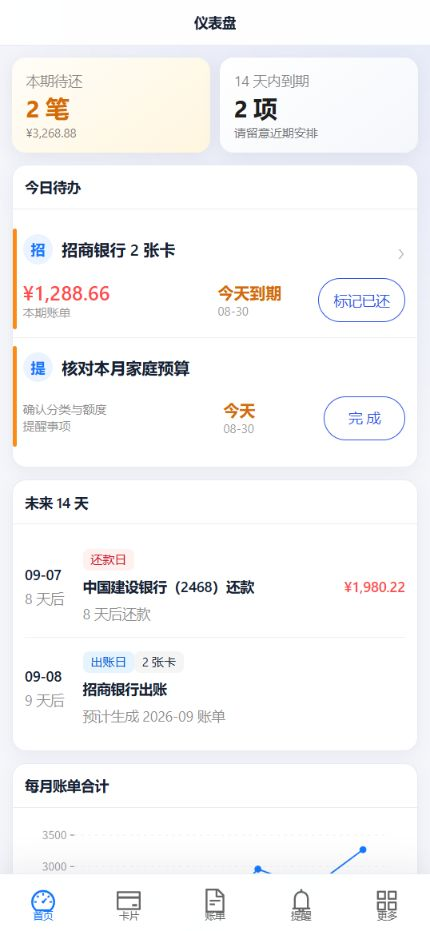

# 守候信用卡小管家

一个面向个人自托管的信用卡账单与到期提醒工具。它会通过 IMAP 读取银行账单邮件，解析账单和交易明细，管理还款、年费及自定义提醒，并通过 Bark 等通知渠道推送当日事项。

- 当前稳定版本：`v0.1.0`
- 官方容器镜像：`ghcr.io/kukushouhou/card-bill-assistant:0.1.0`

> 该项目处理邮箱授权码和信用卡信息，建议仅部署在可信设备上，使用 HTTPS，并定期备份数据库与 `.env`。不要将应用或 MySQL 端口直接暴露到公网。

## 主要功能

- 单管理员账户，首次访问通过 Web 安装向导完成配置。
- IMAP 增量同步账单邮件，不会将邮件标记为已读。
- 版本化银行解析器，支持账单摘要、多卡合账和交易明细。
- 招商银行「每日信用管家」本账期未出账单日度明细同步。
- 信用卡、账单、交易明细、还款状态、年费日和自定义提醒统一管理。
- 每日提醒与每两小时邮件同步，提醒时间可配置。
- 同时适配电脑端与触屏端：桌面布局支持鼠标键盘操作，手机和平板提供触屏响应式界面。

## 界面预览与设备支持

本项目是响应式 Web 应用，无需安装原生客户端。电脑浏览器、手机和平板浏览器访问同一地址即可使用；桌面端会充分利用宽屏空间，触屏端会切换为适合手指操作的导航和信息布局。

| 使用设备 | 支持情况 | 交互形态 |
| --- | :---: | --- |
| 电脑端 | ✓ | 宽屏卡片/表格布局，适合鼠标与键盘 |
| 手机触屏端 | ✓ | 移动导航、单列信息流与大触控区域 |
| 平板触屏端 | ✓ | 根据可用宽度在移动与多列布局间自适应 |

### 卡片中心（电脑端）



### 首页（触屏端）



## 支持的银行邮件与解析层级

解析器按已获得的银行邮件模板校准，并非对银行所有历史和未来格式的承诺。银行改版后可能需要新的版本化解析器。

- **账单摘要**：出账日/账单期、还款日、应还金额、最低还款额、币种和卡尾等，以邮件实际提供字段为准。
- **交易明细**：正式账单中的交易日期、摘要、金额、币种与卡尾等结构化数据。
- **未出账单日度明细**：尚未形成正式账单的本账期日度交易；当前仅招商银行「每日信用管家」支持。

| 银行 | 已校准模板 | 账单摘要 | 交易明细 | 未出账单日度明细 | 说明 |
| --- | --- | :---: | :---: | :---: | --- |
| 招商银行 | 2016 / 2020 / 2026 | ✓ | ✓ | ✓ | 2020/2026 账单支持明细；日度明细仅同步本账期，正式账单仍是还款和统计依据 |
| 中国工商银行 | 2026（含历史附件形态） | ✓ | ✓ | — | 支持正文或账单附件中的明细 |
| 中国农业银行 | 2019 / 2026 | ✓ | ✓ | — | 支持新旧发件域名和对账单格式 |
| 中国银行 | 2020 / 2026 | ✓ | ✓ | — | 支持邮件正文及 PDF 账单文本 |
| 中国建设银行 | 2026 | ✓ | ✓ | — | 支持多卡和原交易/入账币种信息 |
| 交通银行 | 2019 / 2026 | ✓ | ✓ | — | 支持人民币与美元账户 |
| 中信银行 | 2020 / 2023 / 2026 | ✓ | ✓ | — | 卡尾优先以交易明细中的四位卡尾为准 |
| 中国光大银行 | 2016 / 2017 / 2019 / 2026 | ✓ | ✓ | — | 支持多版本邮件/PDF 格式和多币种 |
| 华夏银行 | 2020 / 2026 | ✓ | ✓ | — | 支持人民币与美元账户 |
| 广发银行 | 2026 | ✓ | ✓ | — | 支持多卡与多币种明细 |
| 兴业银行 | 2026 | ✓ | ✓ | — | — |
| 平安银行 | 2019 / 2026 | ✓ | ✓ | — | 支持合并账单的多卡区块归属 |
| 浦发银行 | 2021 / 2026 | ✓ | — | — | 邮件只提供账单金额、最低还款额和日期等摘要，明细位于银行跳转页，当前不抓取 |
| 中国民生银行 | 2026 | ✓ | ✓ | — | 支持人民币与美元账户 |
| 中国邮政储蓄银行 | 2022 / 2026 | ✓ | ✓ | — | 支持新旧发件域名 |
| 北京银行 | 2021 / 2026 | ✓ | ✓ | — | 现役模板支持合并账单明细 |
| 南京银行 | 2023 / 2026 | ✓ | ✓ | — | 2026 模板支持明细；2023 海报式历史模板为摘要级 |
| 湖南银行 | 2026（兼容华融湘江银行域名） | ✓ | ✓ | — | 支持合并账单多卡尾 |
| 湖南农信 | 2026 | ✓ | ✓ | — | 支持福祥信用卡电子账单 |
| 长沙银行 | 2026 | ✓ | ✓ | — | 支持合并账单多卡尾 |

一封邮件只有在发件人、标题和模板特征命中解析器后才会进入账单流程。不匹配的营销邮件不会被当成账单。

## 安全与数据边界

- 完整卡号、有效期和 CVV 使用「环境主密钥 + 用户 PIN」双密钥 AES-256-GCM 加密。
- PIN 不存储在后台；后台仅保存用于校验的随机盐和验证器。
- 邮件正文不入库；数据库保存邮件元数据和解析后的结构化账单/交易数据。
- IMAP 同步只读取新 UID，不会将银行邮件标记为已读。
- `ENCRYPTION_KEY` 一旦用于写入数据便不能更换，否则已有密文无法解密。
- 本项目不代替银行官方账单、还款通知或账户安全措施。

## 部署方式

项目同时提供官方 Docker 镜像部署、Docker 源码构建和不使用 Docker 的源码部署。NAS 用户优先选择官方镜像；需要修改代码时再选择源码构建。

## 方式一：使用官方 Docker 镜像（推荐）

### 前置条件

- 64 位 `amd64` 或 `arm64` 主机。
- Docker Engine 与 Docker Compose v2。
- 内置模式使用项目提供的 MySQL 8.4；外置模式需要已创建的 MySQL 数据库及建表权限。

### 方案 A：内置 MySQL（推荐）

先克隆 `v0.1.0` 的部署文件：

```bash
git clone --branch v0.1.0 --depth 1 https://github.com/kukushouhou/card-bill-assistant.git
cd card-bill-assistant
```

Linux/NAS（内置 MySQL）：

```bash
sh ./scripts/gen-env.sh
docker compose pull
docker compose up -d
```

Windows PowerShell（内置 MySQL）：

```powershell
pwsh ./scripts/gen-env.ps1
docker compose pull
docker compose up -d
```

该方案会启动应用与 MySQL 两个容器，数据保存在 `db-data` Docker 卷中。MySQL 没有对宿主机暴露端口。

### 方案 B：外置 MySQL

Linux/NAS：

```bash
sh ./scripts/gen-env.sh --external
# 在目标主机本地编辑 .env 中的 DATABASE_URL
docker compose -f docker-compose.external.yml pull
docker compose -f docker-compose.external.yml up -d
```

Windows PowerShell：

```powershell
pwsh ./scripts/gen-env.ps1 -External
# 在目标主机本地编辑 .env 中的 DATABASE_URL
docker compose -f docker-compose.external.yml pull
docker compose -f docker-compose.external.yml up -d
```

MySQL 密码中的特殊字符必须进行 URL 编码。例如 `@` 为 `%40`、`&` 为 `%26`、`#` 为 `%23`。

### 关键环境变量

| 变量 | 必填 | 默认值 | 用途 |
| --- | :---: | --- | --- |
| `APP_VERSION` | 否 | `0.1.0` | GHCR 镜像版本；生产环境建议固定版本 |
| `DATABASE_URL` | 外置模式 | 无 | MySQL 连接串 |
| `MYSQL_ROOT_PASSWORD` | 内置模式 | 脚本随机生成 | MySQL root 密码 |
| `MYSQL_PASSWORD` | 内置模式 | 脚本随机生成 | 应用数据库账号密码 |
| `ENCRYPTION_KEY` | 是 | 脚本随机生成 | 邮箱授权码和卡信息的环境主密钥，不可更换 |
| `JWT_SECRET` | 是 | 脚本随机生成 | 登录会话签名 |
| `COOKIE_SECURE` | 否 | `true` | HTTPS 部署保持 `true`；仅局域网纯 HTTP 部署才设 `false` |
| `APP_BIND_IP` | 否 | `0.0.0.0` | 宿主机绑定地址 |
| `APP_PORT` | 否 | `3000` | 宿主机访问端口 |
| `APP_NAME` | 否 | 守候信用卡小管家 | 登录页、导航栏、页面标题和通知名称 |
| `REMINDER_HOUR` | 否 | `8` | 上海时区每日提醒小时（0–23） |
| `BARK_URL` | 否 | 空 | Bark 推送地址，也可在 Web 安装向导中配置 |

启动脚本默认不覆盖已有 `.env`。升级或迁移时必须保留原来的 `ENCRYPTION_KEY`。

## 方式二：使用 Docker 从源码构建

需要审阅、修改源码或自行生成本地镜像时，在对应数据库编排上叠加 `docker-compose.build.yml`：

```bash
# 内置 MySQL
sh ./scripts/gen-env.sh
docker compose -f docker-compose.yml -f docker-compose.build.yml up -d --build

# 外置 MySQL
sh ./scripts/gen-env.sh --external
# 在目标主机本地编辑 .env 中的 DATABASE_URL
docker compose -f docker-compose.external.yml -f docker-compose.build.yml up -d --build
```

本地构建镜像名为 `card-bill-assistant:local`，不会覆盖官方 GHCR 镜像。

## 方式三：手动源码部署（不使用 Docker）

适合已经自行维护 Node.js 进程、MySQL、HTTPS 反向代理和系统服务的环境。需要 Node.js 24 与 MySQL 8：

```bash
git clone --branch v0.1.0 --depth 1 https://github.com/kukushouhou/card-bill-assistant.git
cd card-bill-assistant

cd web
npm ci
npm run build

cd ../server
cp ../.env.example .env
# 在本机编辑 server/.env，至少填写 DATABASE_URL、ENCRYPTION_KEY、JWT_SECRET
# 通过 HTTPS 部署时将 COOKIE_SECURE 改为 true
npm ci --omit=dev
npx prisma generate
npx prisma migrate deploy
NODE_ENV=production npm start
```

服务端会直接托管 `web/dist`，默认监听 `3000` 端口。生产环境应使用 systemd、Supervisor 或 NAS 套件守护进程，并通过 HTTPS 反向代理访问。Windows PowerShell 可将最后一行改为 `$env:NODE_ENV='production'; npm start`。完整的升级、服务守护与备份说明见 [DEPLOY.md](./DEPLOY.md)。

## 使用 AI 协助部署

仓库根目录提供了 [AI 部署提示词](./AI_DEPLOYMENT_PROMPT.md)。它是上述手动说明的辅助入口，而不是唯一部署方式。将提示词复制给能访问目标环境的 AI 助手后，AI 会先确认安装/升级状态、官方镜像或源码构建、内置或外置 MySQL、NAS 架构、HTTPS、端口和备份位置，再帮助生成安全配置。

提示词要求 AI 不在对话中回显密钥、不覆盖既有 `.env`、不删除数据卷，并为每项选择说明推荐默认值。

### HTTPS 与登录 Cookie

Docker 默认 `COOKIE_SECURE=true`。请在 NAS 或网关中将 HTTPS 域名反向代理到应用端口。如果只在受信任的局域网使用纯 HTTP，需要显式设置：

```env
COOKIE_SECURE=false
```

纯 HTTP 不提供传输加密，不建议用于无线公共网络或任何公网环境。

### 首次安装

访问应用地址后，Web 向导会依次完成：

1. 数据库环境检查。
2. 设置内置 `admin` 管理员密码和可选的六位 PIN。
3. 选择并配置通知渠道，也可暂时跳过。
4. 完成安装并登录。

安装完成后 `POST /api/setup/install` 会永久拒绝再次安装。

### 健康检查与日志

```bash
docker compose ps
docker compose logs --tail=200 app
curl -fsS http://127.0.0.1:3000/api/health
```

如果修改了 `APP_PORT`，请在健康检查中使用实际端口。Compose 已为应用和 MySQL 配置日志轮转。

更完整的备份、升级和运维命令见 [DEPLOY.md](./DEPLOY.md)。

## 本地开发

环境要求：Node.js 24+ 与 MySQL 8。

```bash
# 后端
cd server
npm install
npx prisma generate
npx prisma migrate deploy
npm run dev

# 前端（另一个终端）
cd web
npm install
npm run dev
```

开发环境后端默认为 `http://localhost:3000`，前端为 `http://localhost:5173`。Vite 会将 `/api` 代理到后端。

提交前验证：

```bash
cd server
npm test
npm run typecheck

cd ../web
npm run build
```

## 新增银行解析器

1. 在 `server/src/parsers/banks/` 新建「银行拼音-校准年份」文件。
2. 实现解析器接口，以发件人和账单标题建立白名单。
3. 在 `server/src/parsers/registry.ts` 注册，新模板优先级高于历史模板。
4. 增加脱敏样本测试，确保失败时可回退历史解析器。
5. 不要提交真实邮件原文、持卡人姓名、完整卡号、邮箱授权码或本地 `.env`。

## 技术栈

- 后端：Node.js 24、Express 5、Prisma 7、MySQL、Vitest。
- 前端：React 19、Vite 8、Ant Design 6、Ant Design Mobile、`@ant-design/plots`。
- 部署：Docker 多阶段构建、Docker Compose、内置/外置 MySQL 双模式。

## 许可证

本项目使用 [MIT License](./LICENSE)。
