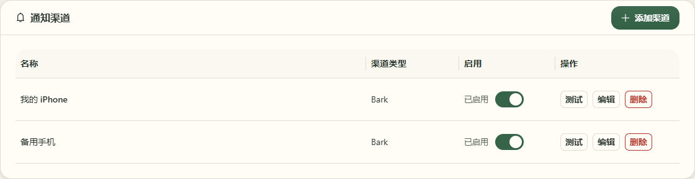
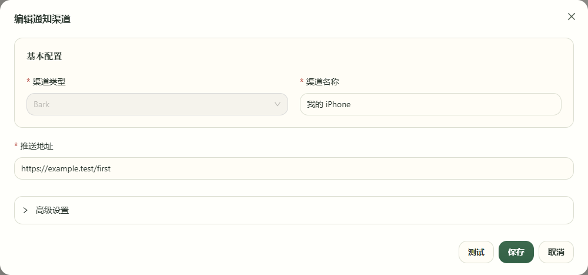
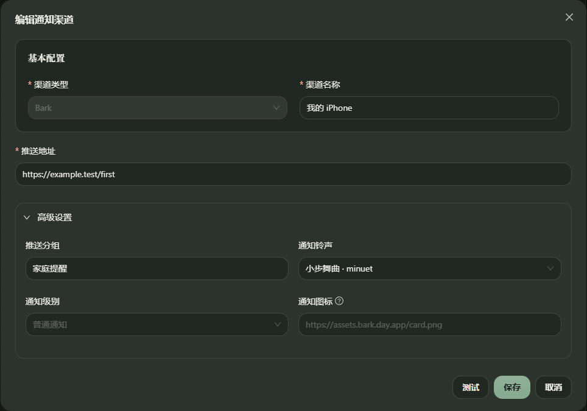
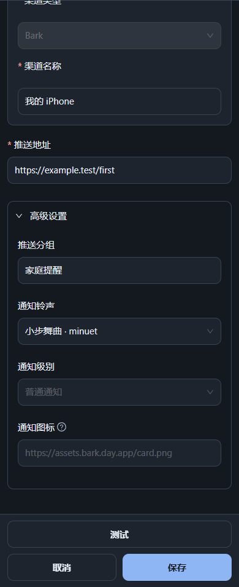
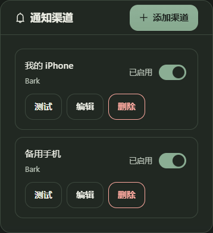

# 通知渠道实例化验收

本次为未发布源码变更，不改版本号、不打标签、不发布镜像。通知重构与工作区中并行的应用升级框架修改分开管理。

## 交互与视觉边界

- 系统设置沿用邮箱账户的桌面表格、手机卡片管理方式；每份配置独立命名、测试、编辑、启停和删除，允许重复添加 Bark。
- 编辑沿用 `BusinessFlow`、`MobileFlow`、主题图标、`SettingSwitch`、`presentation-form-section` 和草稿保护。桌面字段并排，手机单列；编辑状态位于稳定页面层，切换 1024px 断点不丢草稿。
- 常驻渠道介绍和“已配置”标签已移除，高级设置默认折叠。折叠不删除配置，测试不保存或启用实例。
- Bark 提供 32 个可搜索内置铃声，名称依据 [Bark 官方 Sounds 目录](https://github.com/Finb/Bark/tree/master/Sounds)。另设“使用手机已导入的铃声”，只有选择后才显示名称输入与导入条件；不会生成或上传音频。未填写分组仍使用原有“还款提醒”，测试与正式发送使用相同分组规则。
- 安装向导可添加多份同类型配置，返回上一步、修改与安装失败后重试均保留各自配置。

## 结构升级与旧数据

唯一新增的迁移是 `server/prisma/migrations/20260906180000_notification_channel_instances/migration.sql`：增加可空唯一列 `deliveryKey`，移除 `type` 唯一索引。没有数据回填 SQL，也没有注册 silent / optional / required 应用数据迁移。

| 记录 | 有效发送标识 | 保留行为 |
| --- | --- | --- |
| 原有渠道，`deliveryKey` 为 NULL | 原 `type`，如 `bark` | 编号、名称、密文、启用状态不改写；继续命中历史发送日志 |
| 新增渠道 | 服务端生成的 `instance:<UUID>` | 同类型多个实例分别预占、去重、发送与重试 |
| 编辑或停用后再启用 | 原标识不变 | 不产生新发送身份；仅启停或改名不重存配置密文 |

历史 `NotifyLog` 原样保留。删除渠道仅删除指定实例，历史日志不级联删除；重新添加产生新身份。客户端不能编辑 `type` 或 `deliveryKey`，接口也不返回内部发送标识。

继续使用既有结构升级流程：Docker 的 `prisma migrate deploy && tsx src/index.ts` 保证迁移成功才启动应用；源码部署仍须先执行结构迁移。结构迁移失败不得跳过，也不转为应用数据迁移弹窗。

隔离 MySQL 演练已完成：

- 旧版结构先写入合成旧渠道和 sent / pending 日志，再应用新迁移。对旧列及日志全量快照计算 SHA-256，升级前后相同；旧记录 `deliveryKey` 为 NULL。
- 新增同类型记录成功，重复非空 `deliveryKey` 被数据库拒绝；再次执行 migrate deploy 无重复变更。
- 全新空库执行所有 Prisma 迁移成功；两个临时数据库和临时迁移目录已删除。
- 最后完成本地 `exp_reminder` 开发库结构升级。该库当时渠道与日志均为 0 条，升级后仍为 0 条；有存量数据的保留性由上述隔离旧库验证，不冒称开发库存在旧记录。

## 接口及验证记录

所有设置接口沿用登录鉴权。新增 `POST /api/settings/notification-channels`，编辑、删除、已保存配置测试分别使用 `PUT /:id`、`DELETE /:id`、`POST /:id/test`；草稿测试使用 `POST /api/settings/notification-channels/test`。安装向导与设置页共用创建校验、配置加密和发送标识生成逻辑。

- 后端全量：32 个文件、402 项测试通过，覆盖接口鉴权、同类型实例、不可变身份、旧日志防重、独立失败重试、损坏密文隔离及 Bark 业务响应失败。
- 前端全量：7 个文件、26 项测试通过；前后端类型检查、前端生产构建通过。构建仍有现存大分包提示，未扩大依赖。
- 浏览器：通知专项 11 项与关联回归 17 项经分批运行及定向复核全部通过；覆盖 modern / warm-ledger、浅色 / 深色和 360 / 390 / 768 / 1023 / 1024 / 1440px。验证无横向溢出、桌面字段并排、手机操作区可达及高级字段可滚动到操作区上方。
- 浏览器使用合成数据，独立端口、皮肤存储、前端产物与测试输出目录；不访问真实邮箱、不向真实设备推送。一次共享 `web/dist` 被并行重建导致的 ENOENT 已定位并用隔离构建重新验证。

## 实际页面截图

桌面列表与默认折叠编辑态：

两套皮肤的深色高级设置及手机列表（手机高级设置截图为滚动后的状态）：

